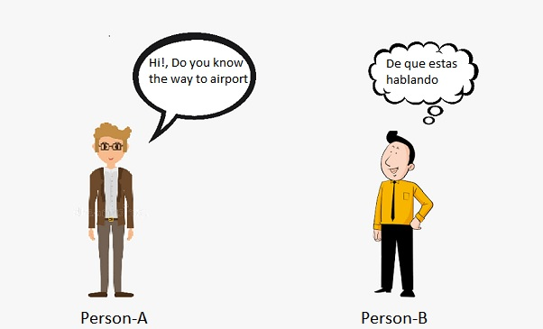
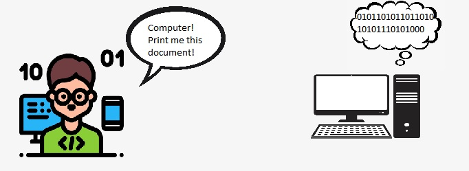
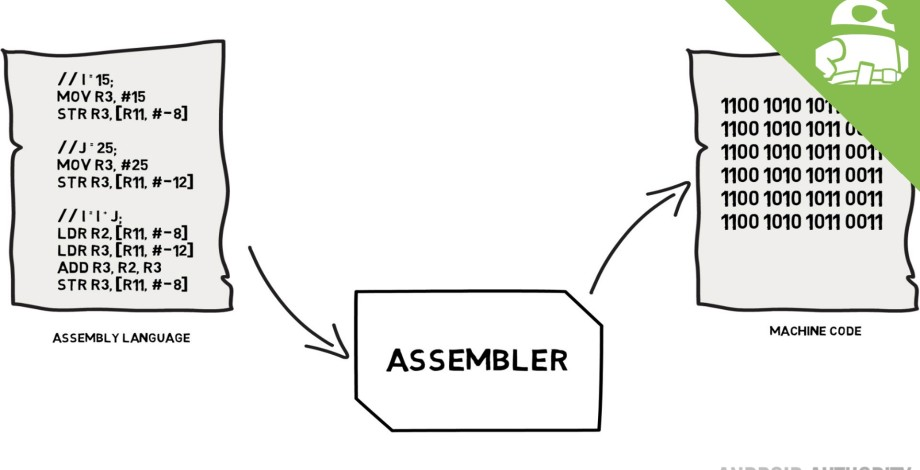

### How Computers works with programs 
##### What are Computers 
> Computers is a machine that are instructed to do some task via computer programming and it stores information(data) and outputs information(data) (by Wikipedia 2020)

* The main reason for manufacturing computers in early 19's is to make any tasks faster than humans with no (or minimum) error. 
* The Computers are made of collection of small devices like drivers , circuits , registers , logic gates , transitors etc .  
* All these devices takes only 1's and 0's as inputs. 
* The only language the computers know are binary numbers ( 0's and 1's ). Which is difficult for humans to learn  
* And humans have their own language like english , spanish etc . and we may need to learn the binary numbers to talk to computers ?  
* **Here is a scenario :** A *Person-A* knows only *"English"* and *Person-B* knows only *"Spanish"*.  
Person-A wants to ask the way to Airport to someone and he sees no one around except Person-B .  
How Could he possibly communicate with him ?  
 
 

* Here , Person-A doesn't understand what Person-B saying and Person-B doesn't understand what Person-A saying.  
* If Person-A needs to communicate with Person-B , the he needs someone who knows both "English" and "Spanish".  
* The Man , who is translator will get the task question that Person-B needs to do in "English" and he convert that to "Spanish" , then deliver it to Person-B.  
###### Computer language : 0's and 1's is also known as Machine Language  
* For computer example : Consider a device called printer that prints the documents/images . How to say the printer through computer (that knows only 0's and 1's) to print something ?  
 
* Here we use a translator called **Assembler**.  
* We use a language little bit similar to english on assembler and assembler converts it to machine language and send it to computer(CPU perticularly). 
 

Early computers does only few numerical operations like Add, Subtract. Only using 0's and 1's it was possible to add , subtract any kind of numbers inculing decimal numbers.
Binary number system is a number expressed using only 0 (zero) and 1 (one) . it also said as base-2 numerical system . 

